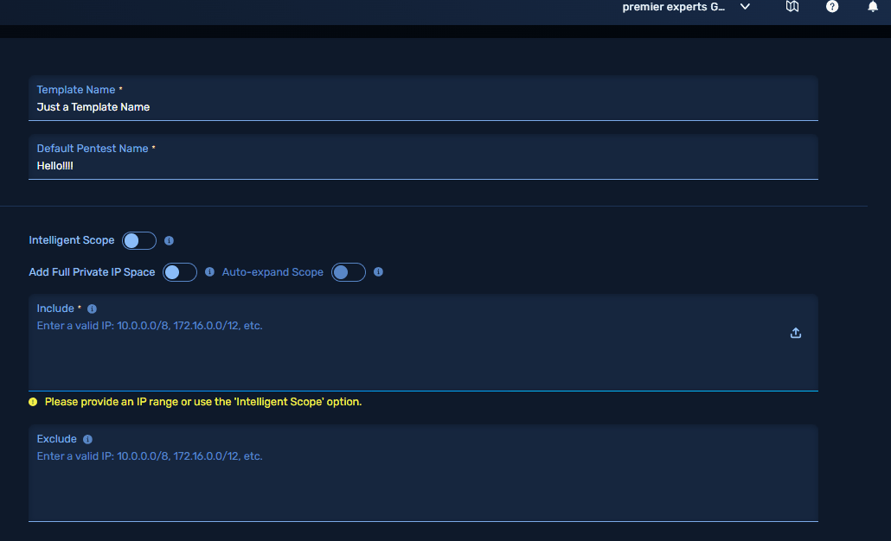

# IP Range Inserter Extension 🚀

A lightweight, fast, and stylish browser extension to **automatically insert IP ranges** into input fields for includes and excludes!

Currently Supported Browser:
- Microsoft Edge
---

## ✨ Features
- **Insert IP Ranges** like `10.10.2.10-240` automatically.
- **Handles Includes and Excludes** separately.
- **Auto-presses Enter** after each IP, simulating real user input.
- **Custom Range Support** (from-to).
- **Super clean UI** — dark mode, stylish buttons, modern layout.
- **Lightweight** and **fast** — pure JavaScript, no frameworks.

---

## 🛠 How to Install (Dev Mode)
1. Clone this repo:
    ```bash
    git clone https://github.com/YOUR_USERNAME/ip-range-inserter.git
    ```
2. Open your browser (Edge).
3. Navigate to:
    ```
    edge://extensions/    (Edge)
    ```
4. Enable **Developer Mode**.
5. Click **"Load Unpacked"**.
6. Select the project folder (`ip-range-inserter/`).
7. Done! 🚀

---

## 📦 How It Works
- You input an IP range like:  
  `10.10.2.10-20`
- The extension types:
10.10.2.10 (Enter) 10.10.2.11 (Enter) 10.10.2.12 (Enter) ... 10.10.2.20 (Enter)


  
- Supports both **Include** and **Exclude** fields automatically.

---
## 🧠 Credits
Made with 🖤 by Dimi

---

## 📄 License
This project is licensed under the [MIT License](LICENSE).
